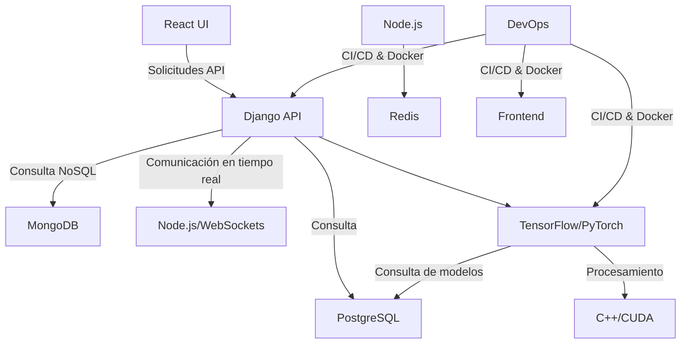

# 🏠 OmniSuite - Arquitectura del Proyecto

## 📌 1. Introducción
OmniSuite es una plataforma integral diseñada para la automatización y análisis de datos con un enfoque modular y escalable. Su arquitectura combina tecnologías modernas para garantizar alto rendimiento, flexibilidad y seguridad.

---

## 🏗️ 2. Estructura del Proyecto
```plaintext
omnisuite/
│── backend/               # Backend con Django y Node.js
│── frontend/              # Frontend con React.js y D3.js
│── ml_models/             # Machine Learning con TensorFlow y PyTorch
│── cplusplus/             # Computación de Alto Rendimiento con C++
│── devops/                # CI/CD, Docker, Kubernetes
│── docs/                  # Documentación del proyecto
│── tests/                 # Pruebas generales
│── omnistart.sh           # Script para iniciar todos los servicios
│── setup.py               # Instalación de dependencias
│── docker-compose.yml     # Configuración de Docker Compose
│── omnistack.json         # Configuración global del proyecto
```

Cada módulo tiene una responsabilidad específica, lo que permite un desarrollo independiente y la escalabilidad del sistema.

---

## 🔹 3. Tecnologías Utilizadas

### **Backend**
- Django (Python) → API REST.
- Node.js (Express + WebSockets) → Comunicación en tiempo real.
- PostgreSQL → Base de datos relacional.
- MongoDB → Base de datos NoSQL.
- Redis → Caché para mejorar rendimiento.

### **Frontend**
- React.js → Interfaz de usuario dinámica.
- D3.js → Visualización avanzada de datos.
- Tailwind CSS → Estilos optimizados.

### **Machine Learning**
- TensorFlow / PyTorch → Entrenamiento y ejecución de modelos.
- Jupyter Notebooks → Experimentación y pruebas.

### **Computación de Alto Rendimiento**
- C++ con OpenMP y CUDA → Procesamiento optimizado.
- PyBind11 → Integración con Python.

### **DevOps & Infraestructura**
- Docker & Kubernetes → Contenedores y orquestación.
- GitHub Actions / GitLab CI/CD → Despliegues automatizados.
- NGINX → Balanceo de carga.
- Terraform → Infraestructura como código.
- Prometheus & Grafana → Monitoreo.

---

## 📌 4. Flujo de Trabajo



### **Explicación**
1. **El frontend (React.js)** envía solicitudes a la API (Django).  
2. **El backend** interactúa con PostgreSQL y MongoDB.  
3. **Node.js con WebSockets** maneja eventos en tiempo real.  
4. **Los modelos de ML** procesan datos y almacenan resultados.  
5. **C++ con CUDA/OpenMP** optimiza cálculos.  
6. **DevOps automatiza despliegues** con Docker/Kubernetes.  

---

## 🌍 5. Infraestructura en la Nube
OmniSuite se despliega tanto en entornos **locales** como en **nube**, utilizando tecnologías como:
- **AWS (EC2, S3, Lambda)**
- **Google Cloud (Cloud Run, AI Platform)**
- **Azure (Kubernetes Service, ML Studio)**
- **Terraform** para gestión de infraestructura.

El monitoreo se realiza con **Prometheus y Grafana**, asegurando rendimiento y estabilidad.

---

## 📌 6. Conclusión
Esta arquitectura modular permite escalar cada componente de forma independiente, asegurando eficiencia y flexibilidad en el desarrollo y despliegue de OmniSuite.

---

📄 **Autor:** Equipo de desarrollo de OmniSuite  
🗓 **Última actualización:** 30/03/2025
